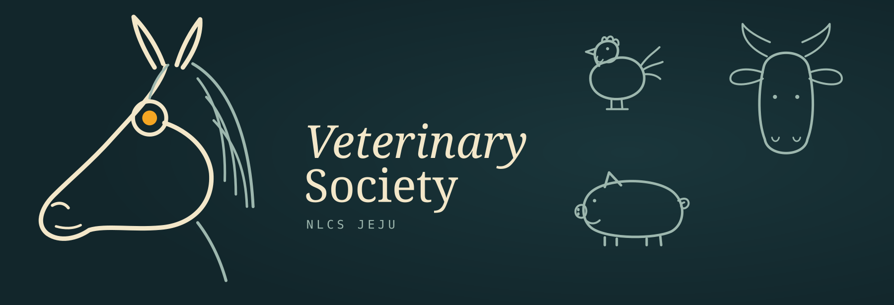
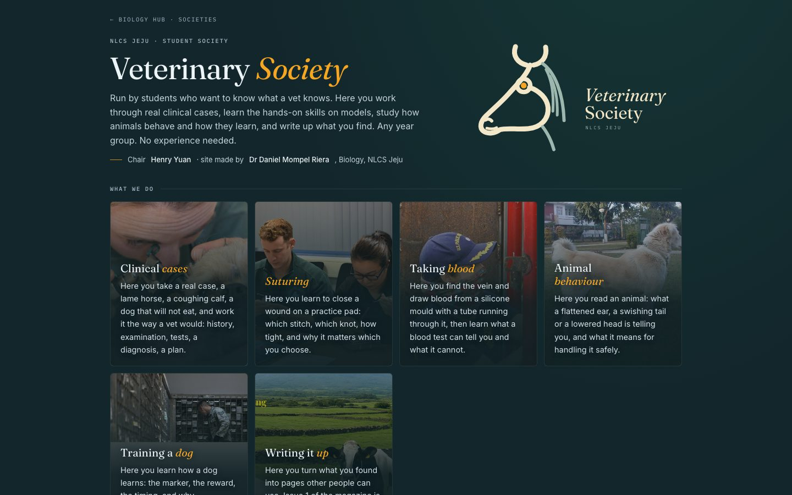

 

# Veterinary Society

**NLCS Jeju · a society run by students who want to know what a vet knows.**

---

Clinical cases worked the way a vet would work them. Suturing on a practice pad. Taking blood
from a silicone mould with a vein in it. How animals behave, and how a dog learns. Then writing
it up: **[Island Immunity](https://mompel226.github.io/veterinary-society/assets/Island-Immunity-1.pdf)**,
issue 1, four Jeju farm animals and the diseases that threaten them, written and edited by
the society.

On the page, a student signs in with the school Google account, puts their name down, and
votes for the ideas they want the society to take on this year. The chair sees who is interested
and what they voted for.

**Want to join, or write for issue 2?** Email the chair, Henry Yuan: scyuan29@pupils.nlcsjeju.kr

<b>For the chair: switching on sign-in and the votes</b> — one afternoon, once

 

The list of who is interested, and the votes, are kept in a small Google Sheet of the society’s
own. It has nothing to do with the school’s marks. It is switched on once, by whoever looks after
the society, like this.

1. **Make a new Google Sheet** and name it *Veterinary Society*. Make it in an account that
   will outlive you: a departmental or society account if the school has one, or a Shared Drive.
2. In the sheet, open **Extensions ▸ Apps Script**. Delete what is there and paste in the whole of
   [`apps-script/Code.gs`](apps-script/Code.gs) from this repository.
3. On the first lines of the script, paste the **Google Client ID** the Biology labs use, between
   the quotes. The site’s address is already one of that ID’s authorised origins, so sign-in
   works here as it does there. Dr Mompel has it.
4. **Run ▸ setup**, once. Google will ask you to allow the script to use the sheet; allow it.
   Two tabs appear, *Interested* and *Votes*.
5. **Deploy ▸ New deployment ▸ Web app.** Execute as **Me**. Who has access: **Anyone**.
   Press Deploy, and copy the address that ends in `/exec`.
6. Open [`config.js`](config.js) in this repository, paste that address between the quotes after
   `scriptUrl`, and commit. Within a minute or two the page shows the sign-in button and the
   votes start counting.

To see who is interested and what they voted for, open the sheet. Share it with the next chair
when the time comes; the page needs nothing else changed.

**If the sheet ever has to move** to a different account: open the copy in the new account, do
steps 2 to 6 again there, and paste the new address into `config.js`. That is all.

<b>What is in this repository</b>

 

| | |
|---|---|
| `index.html` | the page, all of it |
| `config.js` | the two addresses the page needs: the Google Client ID and the script’s `/exec` address |
| `apps-script/Code.gs` | the small script that keeps the list and the votes, for the chair to deploy |
| `assets/` | the magazine, its cover, the pictures behind the cards, and the mark |
| `tools/mark.py` | the numbers the mark is drawn from |

The mark is a stethoscope drawn as a horse’s head: the ear tubes are the ears, the tube runs
round the muzzle and up the cheek, and the chest piece is the eye. The pig, the hen and the cow
are the magazine’s other animals.

 

Made by Dr Daniel Mompel Riera, Biology, NLCS Jeju, for the society. The page is the society’s to change. *Island Immunity* is the work of its writers, who hold the rights to it. The pictures behind the cards are public domain or Creative Commons and are credited on the page itself.
